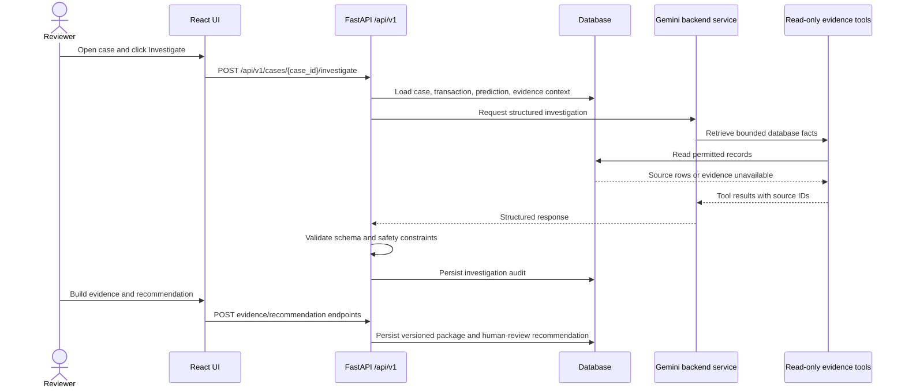

# Agent and Tool Workflow Diagram

```mermaid
sequenceDiagram
  actor Reviewer
  participant UI as React UI
  participant API as FastAPI /api/v1
  participant DB as Database
  participant Gemini as Gemini backend service
  participant Tools as Read-only evidence tools

  Reviewer->>UI: Open case and click Investigate
  UI->>API: POST /api/v1/cases/{case_id}/investigate
  API->>DB: Load case, transaction, prediction, evidence context
  API->>Gemini: Request structured investigation
  Gemini->>Tools: Retrieve bounded database facts
  Tools->>DB: Read permitted records
  DB-->>Tools: Source rows or evidence unavailable
  Tools-->>Gemini: Tool results with source IDs
  Gemini-->>API: Structured response
  API->>API: Validate schema and safety constraints
  API->>DB: Persist investigation audit
  Reviewer->>UI: Build evidence and recommendation
  UI->>API: POST evidence/recommendation endpoints
  API->>DB: Persist versioned package and human-review recommendation
```

The workflow is intentionally non-executing: all financial actions remain out of scope and require human approval outside this system.
