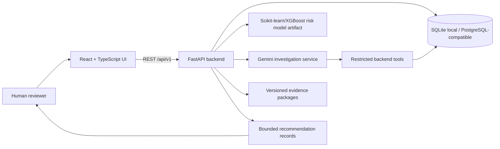

# Architecture Diagram

## Safety boundary

The application separates quantitative ML prediction from the Gemini investigation layer. Gemini is called only by backend services, through restricted tools, after a human reviewer starts an investigation. Recommendations are persisted for review only; the app does not execute refunds, reversals, transfers, payment-network submissions, or account closures.
