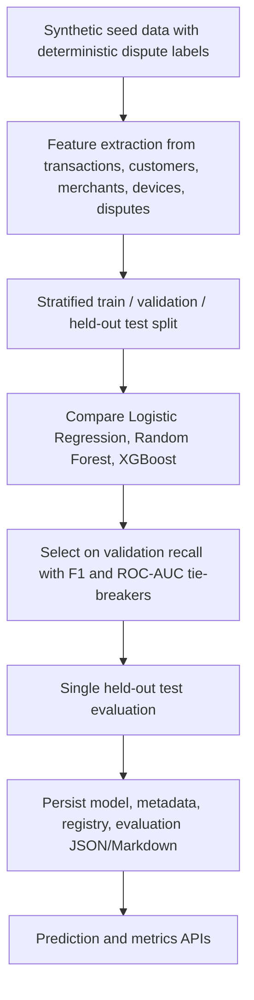

# ML Pipeline Diagram

Metrics shown in the UI and README must come from `backend/artifacts/models/chargeback-risk-v1.evaluation.json` after running `python -m app.ml.train_model`. If that artifact is absent, no performance numbers should be claimed.
